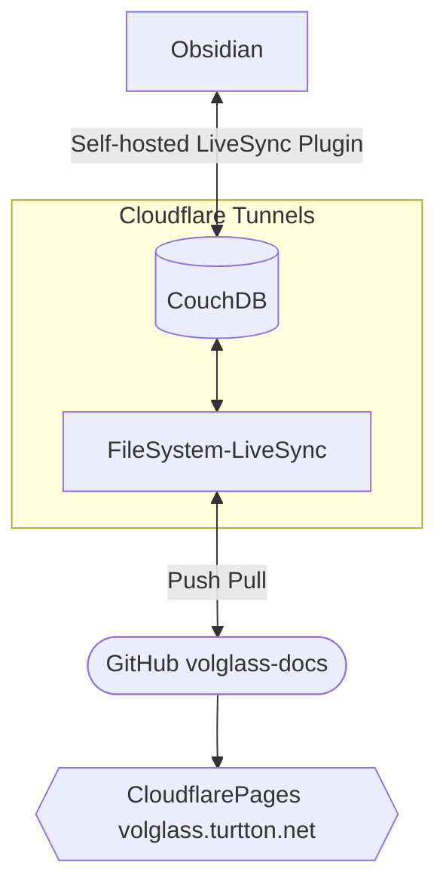

[GitHub - turtton/volglass-docs](https://github.com/turtton/volglass-docs)
Document and demo pages built in [volglass](https://github.com/turtton/volglass).
This page describes how volglass-docs is managed and published.

### Features
- ✅ Real-time synchronization across multiple devices
- ✅ Deploy pages at any time you want
- ✅ No need for your own domain
- ✅ Can be managed in a private repository
- ⚠️ Complex configuration
- ❌ Requires a server to run FileSystem-LiveSync

### Structure

The LiveSync series is a plugin/software developed by [vrtmrz](https://github.com/vrtmrz) to manage Obsidian data in its own database. volglass-docs utilizes these to synchronize data on Obsidian with data on the web.
>For more information on [Self-hosted Livesync](https://github.com/vrtmrz/obsidian-livesync) and [FileSystem-LiveSync](https://github.com/vrtmrz/filesystem-livesync), please see their respective repositories.

Since Self-hosted Livesync is simply set up according to the [official guide](https://github.com/vrtmrz/obsidian-livesync#how-to-use), omit the explanation and describe FileSystem-LiveSync in detail.

### Setup FileSystem-LiveSync
volglass-docs uses custom [Docker Image](https://github.com/turtton/filesystem-livesync) to use git and ssh.
>Here `podman` is used instead of `docker` command. If you use docker, please change it accordingly.
- Clone it and edit `SSH_PRV_KEY_DIR="/path/to/your/ssh/key"`and`SSH_PUB_KEY_DIR="/path/to/your/ssh/key.public"` in `build-docker.sh`
  These ssh key is used by git on push
- Run `sh build-docker.sh` 
- Create a directory **different** from the cloned project and move into it
- Create `autocommit.sh`
  ```sh
  #!/bin/sh  
  
  cd /data/vault/posts  
  
  git pull  
  if grep -q commit=true Commit.md; then  
    sed -i "s/true/false/g" Commit.md  
    echo "start commit"  
    git config --global --add safe.directory /data/vault  
    git config user.name "$GIT_NAME"  
    git config user.email "$GIT_MAIL"  
    git add .  
    git commit -m "$GIT_MESSAGE"  
    git push  
    echo "done"  
    touch Commit.md  
  else  
    echo "commit is not enabled. skipping..."  
  fi

  ```
  >This script checks a file named `Commit.md` in the root of your valut and commits only when the string `commit=true` is present in the file. Feel free to modify it to your liking.
- Create `config.json`(See [official example](https://github.com/turtton/filesystem-livesync#configuration))
  Please set up the settings in `local` section as shown here
  ```json
  {
  ...
        "local": {
            "path": "/data/vault/posts",
            "processor": "/data/autocommit.sh",
            "initialScan": false
        },
  ...
  }
  ```
- Create `launch-image.sh`(Please edit `GIT_NAME` and `GIT_MAIL`)
  ```sh
  podman run --name filesystem-livesync -d -it --security-opt label=disable -e GIT_NAME=your_name -e GIT_MAIL=your@mail.com -e CHOKIDAR_USEPOLLING=1 -v /path/to/filesystem-settings:/data filesystem-livesync
  ```
- Create `vault` directory and move into it.
- Run these commands
	1. `npm init --yes`
	2. `npm install --save-dev volglass-cli`
	3. `npx volglass init`
- Create [.gitignore](https://github.com/turtton/volglass-docs/blob/main/.gitignore)
  If you want to publish with CloudfarePages, please also create [.node-version](https://github.com/turtton/volglass-docs/blob/main/.node-version)
- To connect to github, run
	1. `git init`
	2. `git remote add origin git@github.com:NAME/YOUR_REPOSITORY`
	3. `git add .`
	4. `git comit -m "init commit"`
	5. `git push --set-upstream origin main`

Finally, the file structure should look like this
```str
filesystem-livesync
├build-docker.sh
└...
filesystem-settings
├autocommit.sh
├config.json
├launch-image.sh
├stat.json(automatically created by FileSystem-LiveSync)
└valult
 ├.git(automatically created by git)
 ├.gitignore
 ├.node-version
 ├package-lock.json(automatically created by npm)
 ├package.json
 └posts
  └(your contents)
```
- Return to settings directory, run `sh launch-image.sh`, and you are done!!
>If you are using podman on CoreOS, it is recommended that you do the following to get the container to start after an automatic reboot
>`podman generate systemd --name filesystem-livesync > ~/.config/systemd/user/container-filesystem-livesync.service`
>`systemctl enable --user container-filesystem-livesync.service`

### Setup CloudflarePages
Select `Connect to git` to connect to the your repository.
Settings are shown below
- Framework preset: `None`
- Build command: `npx volglass build`
- Build output directory: /`_volglass`