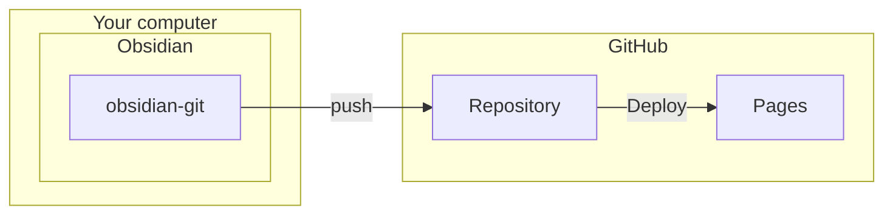

Easiest example. This page explains managing and deploying documents using [denolehov/obsidian-git](https://github.com/denolehov/obsidian-git) and [GitHub Pages](https://pages.github.com/).

### Features

- ✅ Relatively easy deployment
- ✅ Adjusted deployment interval depending on obsidian-git settings
- ⚠️ Only valid for public repositories
- ❌ Requires your domain
  If you use Cloudflare Pages, you can deploy without domain.(Scroll to bottom of the page for the CF Pages version)

### Structure

## Setup valut
⚠️ Prior knowledge of Git and cloning repositories from GitHub is required. 

- Create new repository from [volglass-obsidian-git-gh-pages](https://github.com/turtton/volglass-obsidian-git-gh-pages) and clone it.
  ⚠️ After forking this repository, the initial [Action](https://github.com/turtton/volglass-obsidian-git-gh-pages/blob/main/.github/workflows/deploy.yml) will be automatically triggered. There is no need to wait during this time. (In fact, it is recommended to proceed with the next steps within 5 minutes from here)![[create_new_repository.png]]
- Change the `Build and deployment` option to `GitHub Actions` in the Settings->Pages in the forked repository.![[pages_settings_actions.png]]
- Next, enter the `Custom domain` and click on Save. Please note that you will need to configure DNS settings on the domain management service side. For more details, please refer to the [official documentation](https://docs.github.com/en/pages/configuring-a-custom-domain-for-your-github-pages-site).![[save_custom_domain.png]]
- After that, please access the site and ensure that it displays the same content as [https://example-volglass.turtton.net](https://example-volglass.turtton.net/). If it doesn't display correctly, the following possibilities should be considered:
  - Incorrect DNS settings: Please verify the settings on your domain management service.
  - Failed deployment action: If the latest action in Actions has failed, it may be the cause. The example below demonstrates a successful deployment (marked with a checkmark on the top action).![[action_logs.png]]
    If it has failed, click on the latest history (in the image above, it is `test`), and select `Re-run all jobs` displayed in the upper right corner.![[re-run_all-jobs.png]]
- Start Obsidian and open folder that cloned.![[open_folder_as_vault.png]]
  - Enable the community plugin from settings and install and activate [Obsidian Git](https://github.com/denolehov/obsidian-git).![[install_obsidian_git.png]]
   - Configure automatic backup from `Obsidain git` settings. he following image shows the configuration for performing automatic backups every 5 minutes.
     ⚠️ Since the deployment action takes an average of around 4 minutes, it is recommended to set the interval to be longer than 5 minutes. If it is shorter than this, workflows may be congested.![[obsidian_git_settings.png]]

That's it! Please make sure to modify the contents of the README and confirm that sync to the repository. 
Additionally, deleting the README.md file is not recommended. It serves as the starting point for your site. Instead, consider adding an introduction to your page. 
	If you delete the README file, an empty README is generated automatically on your site.

## Use CloudflarePages instead of GitHubPages
//TODO write next week