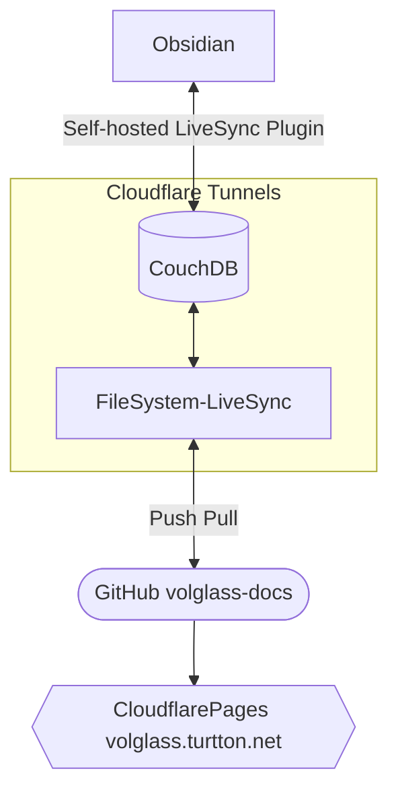

[GitHub - turtton/volglass-docs](https://github.com/turtton/volglass-docs)
[volglass](https://github.com/turtton/volglass)のドキュメント兼デモページ.
このページではvolglass-docsがどのように管理/公開されているかを紹介します

### 特徴
- ✅ 複数端末によるリアルタイム同期
- ✅ 任意タイミングでデプロイが可能
- ✅ 自身のドメインが不要
- ✅ プライベートリポジトリで管理が可能
- ⚠️ 設定が複雑
- 
- ❌ FileSystem-LiveSyncを動かすためのサーバーが必要

### 構造

LiveSyncとの名のついているものは[vrtmrz](https://github.com/vrtmrz)氏によって開発されているプラグインまたはソフトウェアです。volglass-docsではこれらを用いてObsidian上のデータとWeb上のデータを同期させています。
> [Self-hosted Livesync](https://github.com/vrtmrz/obsidian-livesync)と [FileSystem-LiveSync](https://github.com/vrtmrz/filesystem-livesync)の詳細についてはそれぞれのリポジトリをご覧ください。

Self-hosted Livesync は [公式の手順](https://github.com/vrtmrz/obsidian-livesync#how-to-use) に沿ってセットアップを行うだけであるため、FileSystem-LiveSyncのセットアップについて詳細に説明します。

### Setup FileSystem-LiveSync
volglass-docsではgitとsshを使用するために変更を加えた [Docker Image](https://github.com/turtton/filesystem-livesync) を使用しています
>ここでは`docker`コマンドの代わりに `podman` を使用しています。dockerを使用する方は適宜読み変えてください
- 上記のリポジトリをクローンして  `build-docker.sh` 内の`SSH_PRV_KEY_DIR="/path/to/your/ssh/key"`と`SSH_PUB_KEY_DIR="/path/to/your/ssh/key.public"` を書き換え
  これらはgitでssh通信を行う際に使用されます
- `build-docker.sh` を実行
- クローンしたディレクトリとは別のディレクトリを(`filesystem-settings`などの名前で)作成、移動します
- `autocommit.sh`を作成
  ```sh
  #!/bin/sh  
  
  cd /data/vault/posts  
  
  git pull  
  if grep -q commit=true Commit.md; then  
    sed -i "s/true/false/g" Commit.md  
    echo "start commit"  
    git config --global --add safe.directory /data/vault  
    git config user.name "$GIT_NAME"  
    git config user.email "$GIT_MAIL"  
    git add .  
    git commit -m "$GIT_MESSAGE"  
    git push  
    echo "done"  
    touch Commit.md  
  else  
    echo "commit is not enabled. skipping..."  
  fi

  ```
  >このスクリプトはObsidian内のルートフォルダ内の`Commit.md`というファイルを捜索し、そこに`commit=true`と記述されている時のみコミットを行うものです。用途に合わせて変更していただいて構いません。
-  `config.json`を作成([公式のexample](https://github.com/turtton/filesystem-livesync#configuration) 参照)
  `local`の設定は以下のように変更してください
  ```json
  {
  ...
        "local": {
            "path": "/data/vault/posts",
            "processor": "/data/autocommit.sh",
            "initialScan": false
        },
  ...
  }
  ```
- `launch-image.sh`を作成( `GIT_NAME` と `GIT_MAIL`を編集してください)
  ```sh
  podman run --name filesystem-livesync -d -it --security-opt label=disable -e GIT_NAME=your_name -e GIT_MAIL=your@mail.com -e CHOKIDAR_USEPOLLING=1 -v /path/to/filesystem-settings:/data filesystem-livesync
  ```
- `vault` フォルダを作成し移動
- 以下のコマンドを入力
	1. `npm init --yes`
	2. `npm install --save-dev volglass-cli`
	3. `npx volglass init`
- [.gitignore](https://github.com/turtton/volglass-docs/blob/main/.gitignore) を作成
 CloudflarePagesを使用する場合は[.node-version](https://github.com/turtton/volglass-docs/blob/main/.node-version) も作成してください
- Gitの初期設定を行う
	1. `git init`
	2. `git remote add origin git@github.com:NAME/YOUR_REPOSITORY`
	3. `git add .`
	4. `git comit -m "init commit"`
	5. `git push --set-upstream origin main`

この時点で以下のようなディレクトリ構造になっているはずです
```
filesystem-livesync
├build-docker.sh
└...
filesystem-settings
├autocommit.sh
├config.json
├launch-image.sh
├stat.json(automatically created by FileSystem-LiveSync)
└valult
 ├.git(automatically created by git)
 ├.gitignore
 ├.node-version
 ├package-lock.json(automatically created by npm)
 ├package.json
 └posts
  └(your contents)
```
- filesystem-settingsファイルに戻り、 `sh launch-image.sh`を実行すれば完了です
>PodmanをCoreOSのようなOSで実行している場合、自動再起動後にコンテナを起動させる必要があります。以下のコマンドを実行してください
>`podman generate systemd --name filesystem-livesync > ~/.config/systemd/user/container-filesystem-livesync.service`
>`systemctl enable --user container-filesystem-livesync.service`

### Setup CloudflarePages
`Connect to git` を選択して対象のリポジトリを選択します
各種設定は以下の通りです
- Framework preset: `None`
- Build command: `npx volglass build`
- Build output directory: /`_volglass`