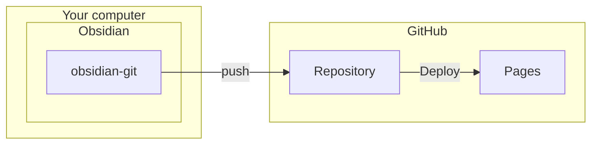

最も手間の少ない例です
ここでは[denolehov/obsidian-git](https://github.com/denolehov/obsidian-git)と[GitHub Pages](https://pages.github.com)を用いたドキュメント管理+デプロイ方法について解説します。

### 特徴
- ✅ 比較的簡単にデプロイが可能
- ✅ obsidian-gitの設定次第でデプロイ間隔などを調整可能
- ⚠️ パブリックリポジトリでのみ有効
- ❌ 自身のドメインが必要
  CloudflarePagesを使うことでドメイン無しでデプロイすることも可能です。詳しくはページ下部をご覧ください

### 構造

## 手順
⚠️ 前提としてGitの実行環境とGitHubからリポジトリをクローンする程度の知識が必要ですが、ここでは詳しく説明しません
- [volglass-obsidian-git-gh-pages](https://github.com/turtton/volglass-obsidian-git-gh-pages)から新規リポジトリを作成、クローンしてください
  ⚠️ フォークした段階で初回の[Action](https://github.com/turtton/volglass-obsidian-git-gh-pages/blob/main/.github/workflows/deploy.yml)が自動的に実行されます。この間に待つ必要はありません(むしろここから5分以内に次の作業を行うことをお勧めします)![[create_new_repository.png]]
- フォークしたリポジトリのSettings->Pagesより`Build and deployment`を`GitHubActions`に変更します![[pages_settings_actions.png]]
- 続けて`Custom domain`を入力し、Saveを押します
  ドメインを管理しているサービス側でのDNSの設定が必要です。詳しくは[公式ドキュメントをご覧ください](https://docs.github.com/ja/pages/configuring-a-custom-domain-for-your-github-pages-site)![[save_custom_domain.png]]
- ドメイン設定後、実際にサイトにアクセスして[https://example-volglass.turtton.net](https://example-volglass.turtton.net)と同じ内容が表示されていることを確認してください
  正しく表示されない場合は、次のことが考えられます
  - DNSの設定が正しくない場合->使用しているドメイン管理サービスの設定をご確認ください
  - ページをデプロイするActionが失敗している->`Actions`より最新のActionが失敗している場合はこれにあたります。以下は成功している場合です(一番上のアクションにチェックマークが付いている)![[action_logs.png]]
    もし失敗している場合は、最新の履歴(上では`test`)をクリックし、右上にある`Re-run all jobs`を選択してください![[re-run_all-jobs.png]]
- Obsidianを起動し、クローンしたフォルダをvaultとして開きます![[open_folder_as_vault.png]]
  - 設定よりコミュニティプラグインを有効にし、[Obsidian Git](https://github.com/denolehov/obsidian-git)をインストール、有効化します![[install_obsidian_git.png]]
   - 設定より自動バックアップ設定を行います。以下は5分毎に自動バックアップを行う設定です
     ⚠️ インターバルは5分以上にすることをお勧めします。これはデプロイのためのActionに平均4分ほどかかるためです。これ以下に設定している場合、ワークフローが渋滞する可能性があります。![[obsidian_git_settings.png]]

以上で完了です。READMEの内容を変更して、正しくRepositoryにpushされることを確認してください。
また、README.md自体はあなたのサイトのスタート地点になるため、削除せず、自身のページの紹介を記載することをお勧めします。(削除した場合、サイト上では自動的に空のREADMEが生成されます)

### GitHub Pages の代わりにCloudflare Pagesを使う
//TODO 来週書く